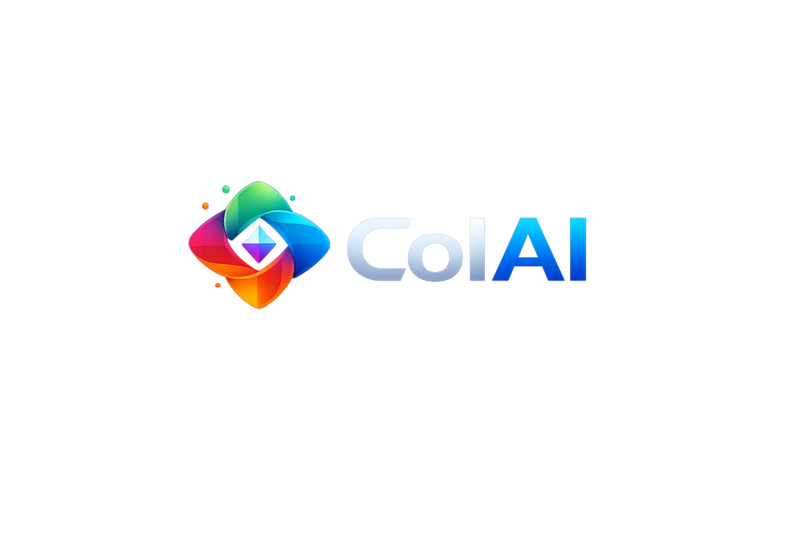

<div align="center">



# ColAI

**Multi-account AI workspace on Android**

An open-source Android workspace built to run multiple independent accounts on ChatGPT, Claude, Gemini, DeepSeek, Grok, and Perplexity simultaneously without cross-account tracking or session resets.

[](LICENSE.md)
[](https://developer.android.com)
[](https://github.com/Ujwal223/ColAI/releases)
[](https://github.com/Ujwal223/ColAI/releases)
[](https://buymemomo.com/ujwal)

</div>

---

## The Problem & The Solution

Standard mobile browsers share cookies and storage across tabs. Switching between work, personal, and research accounts on AI platforms forces you to log in and out repeatedly or juggle multiple separate apps.

**ColAI solves this at the engine level:**
Each account runs inside an isolated **Mozilla GeckoView container** (`contextId`). Cookies, local storage, cache, and IndexedDB data are strictly partitioned per session. You can keep multiple accounts active simultaneously without data leaking between them.

```
┌─────────────────────────────────────────────────────────────────┐
│                       ColAI Application                         │
├─────────────────┬───────────────────────────────┬───────────────┤
│    Personal     │             Work              │   Research    │
│  [contextId: 1] │        [contextId: 2]         │ [contextId: 3]│
├─────────────────┼───────────────────────────────┼───────────────┤
│ Cookies: User A │ Cookies: User B               │ Cookies: Free │
│ Cache: Isolated │ Cache: Isolated               │ Cache: Clean  │
└─────────────────┴───────────────────────────────┴───────────────┘
                                ▲
              Mozilla GeckoView Sandboxed Engine
```

---

## Core Capabilities

<table>
  <tr>
    <td width="50%">
      <h3>Container Isolation</h3>
      <ul>
        <li><b>Hardware-level separation</b>: Powered by GeckoView isolated contexts</li>
        <li><b>Zero data leakage</b>: Independent cookies, storage, and cache</li>
        <li><b>Targeted clearing</b>: Wipe data for one session without affecting others</li>
      </ul>
    </td>
    <td width="50%">
      <h3>Privacy & Security</h3>
      <ul>
        <li><b>PIN & biometric locks</b>: Secure sensitive accounts behind 4-digit PINs</li>
        <li><b>Master recovery key</b>: PBKDF2-hashed emergency access key</li>
        <li><b>Encrypted backups</b>: AES-256-GCM encrypted export and restore</li>
        <li><b>Default privacy headers</b>: Automatically broadcasts <code>DNT</code> and <code>Sec-GPC</code></li>
      </ul>
    </td>
  </tr>
  <tr>
    <td width="50%">
      <h3>Custom Service Studio</h3>
      <ul>
        <li><b>Any web tool</b>: Add custom AI platforms or internal LLM endpoints</li>
        <li><b>Integrated logo tools</b>: Import via file or URL with 90° rotation and square cropping</li>
        <li><b>Instant presets</b>: Pre-configured for ChatGPT, Claude, Gemini, DeepSeek, Grok, and Perplexity</li>
      </ul>
    </td>
    <td width="50%">
      <h3>Home Screen Widgets</h3>
      <ul>
        <li><b>Quick Access (2x2)</b>: Voice dictation and search shortcuts</li>
        <li><b>Bento Medium (4x2)</b>: Deep links directly into your selected account session</li>
        <li><b>Anti-banner blocker</b>: Suppresses intrusive mobile app install banners</li>
      </ul>
    </td>
  </tr>
</table>

---

## Architecture

ColAI is built natively for Android using standard components:

| Layer | Implementation | Purpose |
| :--- | :--- | :--- |
| **User Interface** | Jetpack Compose | Declarative UI, Cupertino styling, fluid layout cards |
| **Web Engine** | Mozilla GeckoView | Sandboxed tab contexts (`contextId`), standards compliance |
| **Local Storage** | AndroidX Room (SQLite) | Relational storage for services, sessions, and configuration |
| **Security** | AndroidX Security Crypto | Keystore-backed MasterKey and AES-256 encryption |
| **Concurrency** | Kotlin Coroutines & Flow | Asynchronous I/O and reactive state pipelines |
| **Widgets** | Android AppWidgetProvider | Native home screen widgets with deep link intents |

---

## Quick Start

### Prerequisites
- Android 8.0+ (API Level 26+)
- JDK 21
- Android Studio or Android SDK Command-line Tools

### Build Commands

```bash
# Clone repository
git clone https://github.com/Ujwal223/ColAI.git
cd ColAI

# Build debug APK
./gradlew assembleDebug       # Linux / macOS
gradlew.bat assembleDebug     # Windows

# Install onto connected device
./gradlew installDebug

# Build release APKs (Universal & ABI splits)
./gradlew assembleRelease
```

For platform-specific environment setup and SDK instructions, see **[SETUP.md](SETUP.md)**.  
For common issues and troubleshooting, see **[TROUBLESHOOTING.md](TROUBLESHOOTING.md)**.

---

## Privacy Notice

- **No telemetry or data collection**: Requests connect directly between your phone and the web services you choose to use.
- **On-device encryption**: Sensitive preferences and keys are secured locally through Android Keystore.
- **Open and inspectable**: Complete source code is available under the Apache 2.0 license.

---

## License & Support

ColAI is developed and maintained by **Ujwal** under the [Apache License 2.0](LICENSE.md).

If you find this project helpful, you can [support development on BuyMeMomo](https://buymemomo.com/ujwal).
